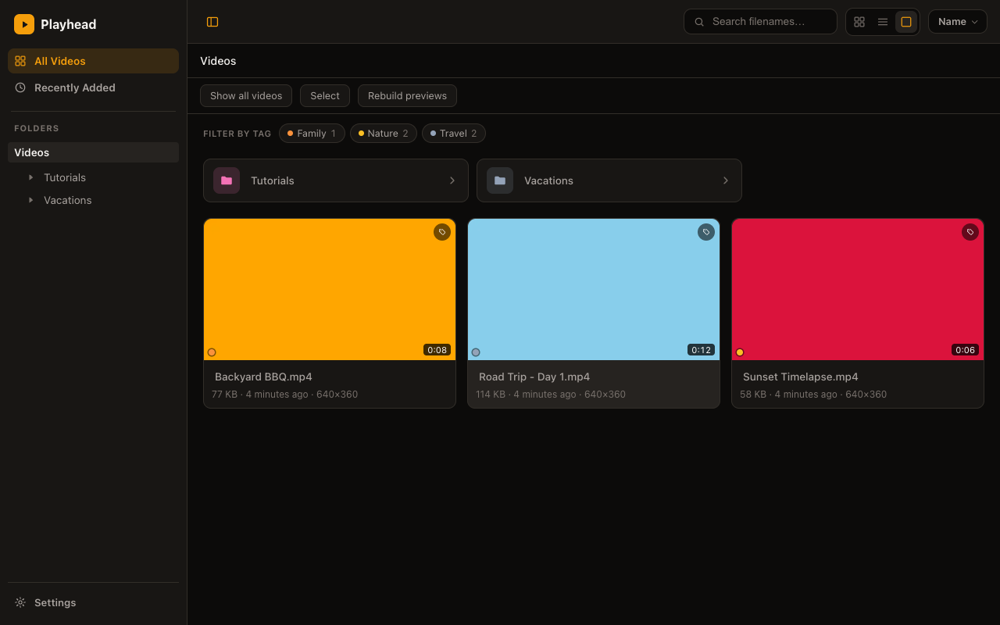
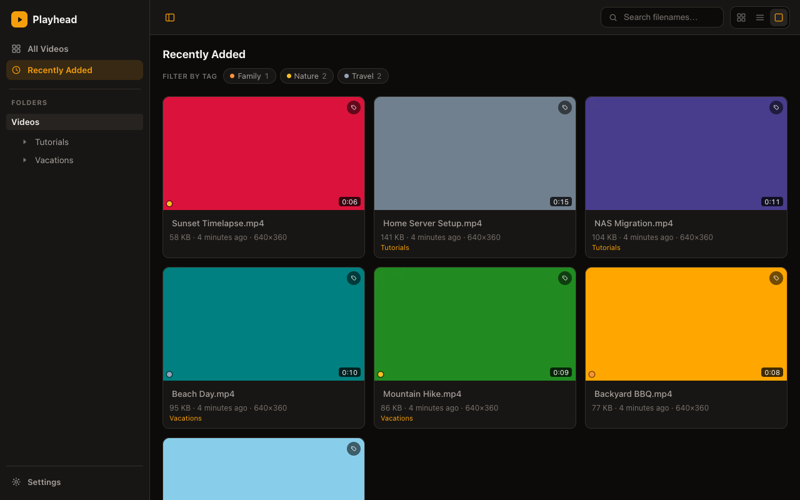
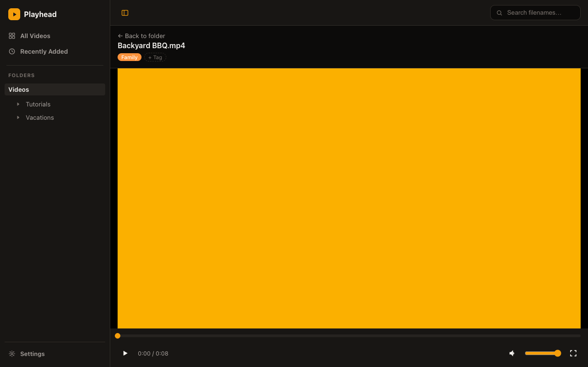
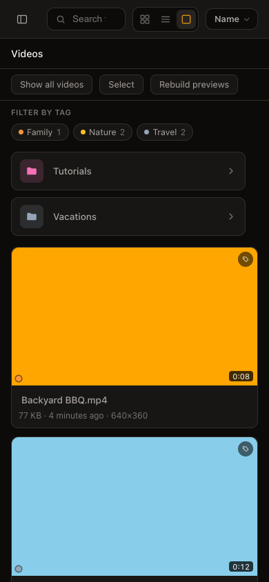

# Playhead

A lightweight, single-user, filesystem-oriented video browser for your own homelab server. Point it at your video folders and it mirrors your existing structure — no importing, no library scraping, no reorganizing. It's not a Jellyfin/Plex-style media library; it's closer to a fast, good-looking Finder/Explorer for videos, with thumbnails, previews, tags, and direct-play streaming.

[](LICENSE)

See [`PRODUCT.md`](PRODUCT.md) for scope/non-goals and [`ARCHITECTURE.md`](ARCHITECTURE.md) for how it's built.

## Screenshots

| | |
|---|---|
|  |  |
|  |  |

## Features

- **Folder-first browsing** — your existing structure, as-is. List, grid, and large-thumbnail view modes; sort by name, date, duration, or size.
- **Thumbnails and scrub previews** — generated in the background without blocking browsing; hover (desktop) or touch-drag (mobile) a card to scrub through a preview strip before opening it, and scrub the same way on the player's timeline.
- **Tags** — freeform, global, deterministically colored. Tag from a card, the player, or in bulk across a selection; filter any view by tag.
- **Recently Added** — a cross-library view of what showed up last, with the same view modes and tag filtering as everywhere else.
- **Direct play, byte-range streaming** — native `HTML5 <video>`, real seeking on multi-hour files, nothing ever transcoded. A container browsers won't play directly (MKV/AVI/TS) but whose codecs are already compatible gets a one-time cached remux (repackaging, not re-encoding) instead.
- **Auto-discovered multi-library support** — mount one folder or several genuinely separate drives; it tells the difference by filesystem mount boundary, no configuration needed either way.
- **Resume position, filename search, configurable exclusions, cache size limits** — the practical stuff a real library needs day to day.
- **One Docker container**, low idle CPU/memory, a guided deploy script that shows you exactly what it's about to mount before it does anything.
- **A single optional login gate** for a household Tailscale network — not a multi-user account system, and not a substitute for keeping this off the public internet.

## Quickstart

The fastest path to running this on a homelab machine — see [`DEPLOY.md`](DEPLOY.md) for the full guided walkthrough, especially if you have more than one media folder:

```bash
cp .env.example .env
# edit .env: set MEDIA_PATHS to your video folder(s)
./deploy.sh
```

`deploy.sh` prints exactly which host folders it's about to mount, and where, and asks for confirmation before building or running anything. Once it's up, open the printed URL to complete first-run setup (server name, admin username/password).

Prefer plain Docker or Compose instead? See [Docker](#docker) below.

## Requirements

- Go 1.27+
- Node.js 20+ and npm
- `ffmpeg`/`ffprobe` on `PATH` — used for metadata indexing (`ffprobe`) and thumbnail generation (`ffmpeg` with a `libwebp` encoder). The app runs without them, just with no duration/codec info and no thumbnails.
- Docker (optional, for containerized deployment — bundles `ffmpeg`/`ffprobe`, so you don't need them on the host in that case)

## Configuration

| Variable | Default | Notes |
|---|---|---|
| `APP_ADDR` | `:8080` | Listen address. |
| `MEDIA_ROOT` | *required* | Absolute path to your media. If you mount several genuinely separate drives/volumes under one parent path, each is auto-discovered as its own library; see Multiple libraries below. Never exposed to the client. |
| `DATA_DIR` | `/data` | Created if missing. Holds `index.db` (the SQLite metadata cache), `cache/thumbs/` (generated WebP thumbnails), `cache/sprites/` (preview sprite sheets + JSON metadata), `cache/remux/` (cached container remuxes — see Container remux below), and `config.json` (server name, login credentials, per-root display overrides — see Onboarding, login, and settings below). |
| `EXTRA_HIDDEN_NAMES` | *(none)* | Comma-separated entry names (case-insensitive) to hide from browsing/indexing/search/root-discovery, in addition to the built-in NAS/OS clutter list (`@eaDir`, `#recycle`, etc.). Example: `Thumbs.db,desktop.ini`. |
| `EXCLUDED_PATHS` | *(none)* | Comma-separated relative folder paths (forward-slash separated, e.g. `Raw Footage,Family/Private`) to exclude entirely from browsing, indexing, flatten, and search — matches the path itself and anything nested under it. |
| `EXCLUDED_EXTENSIONS` | *(none)* | Comma-separated file extensions with a leading dot (e.g. `.avi,.mov`) to exclude even though they're otherwise recognized, playable containers. |
| `CACHE_MAX_BYTES` | *(unlimited)* | Optional cap on `DATA_DIR/cache/`'s total size, in bytes. When exceeded, the oldest-generated thumbnails/sprites/remuxes are evicted first (see [`ARCHITECTURE.md`](ARCHITECTURE.md)). Cached remuxes are typically tens to hundreds of MB each — far larger than a thumbnail or sprite sheet — so this limit matters much more once remuxed files are in the cache. |

### Multiple libraries

Most deployments only ever mount one thing (`-v /path/to/your/videos:/media`), and however you've organized folders inside it (`Anime/`, `Misc/`, `TV/`, whatever) is browsed as one unified library, exactly like folders always have been — that's still `MEDIA_ROOT` itself, shown as a single root named "Videos" by default (renamable from Settings).

If you genuinely mount **multiple separate volumes** under one parent path — e.g. `-v /mnt/movies:/media/Movies -v /mnt/tv:/media/TV` — each is automatically discovered as its own separate library, with its own entry in the library switcher. The app tells the two cases apart itself (by checking whether a subdirectory is a real, distinct filesystem mount, not just a subfolder within one), so you never need to configure which case you're in — just mount things the way that matches your actual storage layout, real drives/volumes as separate mounts, and organizational folders as plain subfolders within one.

## Onboarding, login, and settings

The first time the app starts (no `DATA_DIR/config.json` yet), it shows a one-time setup screen instead of the normal browser: pick a server name, an admin username and password, and optionally rename the media libraries it's already auto-discovered under `MEDIA_ROOT`. Submitting it writes `config.json` and logs you straight in — there's no separate first login. Every later visit (after a restart, in a new browser, etc.) shows a login screen instead, until you sign in with that username/password.

This is a single shared credential for the household, not a multi-user account system (see [`PRODUCT.md`](PRODUCT.md) — deliberately out of scope) and it's a convenience layer on top of your Tailscale/private-network boundary, not a replacement for it: don't expose this app to the open internet on the assumption that a login page alone makes that safe.

A settings page (the gear icon, once logged in) lets you:

- Rename the server or any library.
- Hide a library from the app without un-mounting it.
- **Rescan** — pick up a newly mounted drive/folder as a new library without restarting the container.
- Change the username/password. This immediately signs out every open session (including the one making the change) — there's no way to invalidate just one session, by design (see [`ARCHITECTURE.md`](ARCHITECTURE.md)).

**If you forget the password, there is no reset flow by design** (a shared home-network credential doesn't need email/2FA recovery machinery). Stop the container, delete `DATA_DIR/config.json`, and restart — you'll go through setup again. This never touches `index.db` or your cached thumbnails/sprites/remuxes; only the login/server-name/root-override state is lost.

- `GET /api/config` — public; tells the frontend whether setup is done, whether you're logged in, the server name, and the current library list.
- `POST /api/setup`, `POST /api/auth/login`, `POST /api/auth/logout`.
- `GET /api/settings`, `POST /api/settings` (rename server/libraries, hide a library), `POST /api/settings/rescan`, `POST /api/settings/password`.

## Metadata indexing

On startup, and whenever triggered manually, the app recursively scans your media root(s) and runs `ffprobe` on new or changed files to cache their duration, resolution, container, and codecs in `DATA_DIR/index.db`. This is purely a cache — deleting the file and restarting rebuilds it from scratch without breaking any URL or video ID, since the filesystem is always the source of truth (see [`ARCHITECTURE.md`](ARCHITECTURE.md)). Browsing works immediately and stays responsive during a scan; unindexed files simply show without duration/codec info in the API response until the scan reaches them.

- `GET /api/scan/status` — current/last scan state and file counts.
- `POST /api/scan` — trigger a rescan manually (no-ops if one is already running).

## Thumbnails

Thumbnails generate lazily, in the background, the first time you view a folder — a bounded pool of 1–2 FFmpeg processes (low CPU priority) works through them without blocking browsing or competing with an actively streaming video. Each is a single WebP frame taken at roughly 25% into the video, cached under `DATA_DIR/cache/thumbs/` and named from a hash of the file's ID, size, and modification time, so a changed file gets a fresh thumbnail automatically.

- `GET /api/thumbnails/status` — coverage counts (`ready`/`pending`/`errored`) and active worker count.
- `POST /api/thumbnails/pregenerate` — queue every not-yet-generated thumbnail across all roots, instead of waiting for folders to be viewed.

A job that fails is automatically retried, up to a few times, on a later scan (useful if the failure was environmental — e.g. a permissions problem during deployment) — a file that's genuinely unable to succeed (corrupt, no video stream) stops being retried after that rather than forever. A per-video manual retry is also always available.

## Preview sprites

Each video also gets a preview sprite sheet: a grid of small frames sampled evenly across its *entire* duration (20–150 frames depending on length — a long video gets frames spaced further apart, not a preview truncated to its first part), plus a JSON sidecar of frame timestamps and tile coordinates. The same asset powers hover previews (desktop), touch-drag previews (mobile, on the video cards), and a scrubbing preview strip above the player. Sprites share the same generation pool as thumbnails (still bounded to 1–2 FFmpeg processes total), and generate lazily the same way.

- `GET /api/sprites/status` / `POST /api/sprites/pregenerate` — same shape as the thumbnail pair above.

This is enhancement only: browsing and playback work identically with no sprites generated — cards just show without a scrub preview, and the player's seek bar (native, untouched) still works normally.

## Container remux

Some files have browser-compatible video/audio codecs (H.264 or HEVC video, AAC or MP3 audio) but sit in a container browsers won't play directly — MKV, AVI, or MPEG-TS (`.ts`). For these, the server repackages the existing streams into an MP4 container with `ffmpeg -c copy` — no decoding or re-encoding, just moving bytes into a different container, so it's fast (typically well under a couple of seconds, even for a multi-hundred-MB file) and never transcodes anything (nothing in this app does — see [`ARCHITECTURE.md`](ARCHITECTURE.md)). The remuxed file is generated once, cached under `DATA_DIR/cache/remux/`, and then served exactly like any other video, including full seek support.

A file with an incompatible *codec* (e.g. `mpeg2video`, common on older TV-tuner recordings) isn't helped by this — remuxing only fixes a container problem, not a codec problem — and still shows the "may not play on this device" badge.

- `GET /api/remux/status` — coverage counts (`ready`/`pending`/`errored`) and active worker count.
- `POST /api/remux/pregenerate` — queue every eligible, not-yet-remuxed video across all roots, instead of waiting for it to be requested.
- `POST /api/videos/{id}/remux/retry` — force a specific video to be retried even if it previously failed permanently, without waiting for the file to change.

Remuxing shares the same bounded FFmpeg worker pool as thumbnail/sprite generation, so it never adds unbounded extra load. The very first playback request for a not-yet-remuxed file waits briefly (up to a few seconds) for the remux to finish before streaming starts; pre-generating (via the endpoint above, or just by browsing the folder, which queues it in the background) avoids that wait.

## Filename search

A simple, low-priority substring search against indexed filenames — folder browsing remains the primary way to navigate. Case-insensitive, matches the filename itself (not folder names elsewhere in the path), and reads the index — a file that hasn't been indexed yet just doesn't show up in results until a scan reaches it.

- `GET /api/search?q=<query>&root=<optional>` — `root` scopes to one configured root; omitted, it searches all of them.

## Tags

Freeform, global tags you can attach to any video — type a name while tagging and it's created automatically (with a deterministic color, so the same name always looks the same) if it doesn't already exist. Tag from a video's card, from the player page, or in bulk by selecting several videos at once ("Select" in the folder toolbar). Filter a folder view by one or more tags via the "Filter by tag" row — matching *any* selected tag, not all of them. Tags aren't part of the disposable media index: deleting `index.db` and rescanning never loses them.

- `GET /api/tags` — every tag, with how many videos currently carry it.
- `POST /api/videos/{id}/tags` — body `{"name": "<tag name>"}`; creates the tag if it doesn't exist yet.
- `DELETE /api/videos/{id}/tags/{tagId}` — untag one video.
- `POST /api/tags/bulk` — body `{"videoIds": [...], "name": "<tag name>"}`; applies one tag to several videos at once.
- `DELETE /api/tags/{tagId}` — delete a tag entirely (removes it from every video that had it).
- `GET /api/browse`, `GET /api/search`, `GET /api/recent` all accept `?tags=<id>,<id>,...` to filter.

## Recently Added

A view of the most recently indexed videos across all your libraries, newest first — reachable from the sidebar, with the same Grid/List/Large view modes and tag filtering as a normal folder view. "Recently added" is also available as a sort order there.

- `GET /api/recent?root=<optional>&limit=<optional>&tags=<optional>` — `root` scopes to one library; omitted, spans all of them.

## Resume position

The player remembers roughly where you left off in a video, keyed by its (stable, filesystem-derived) video ID — reopening it shows a dismissable "Resume from X?" prompt rather than silently jumping. Saved periodically during playback and on navigating away; cleared automatically once a video finishes, so a rewatch starts from the top. This is stored separately from the disposable media index, so deleting `index.db` and rescanning never loses it.

- `PUT /api/videos/{id}/resume` — body `{"positionSeconds": <number>}`.
- `DELETE /api/videos/{id}/resume` — clear a saved position.
- `GET /api/videos/{id}` includes `resumeSeconds` when one is saved.

## Cache management

`cache/thumbs/`, `cache/sprites/`, and `cache/remux/` all grow as files change (a changed file's old assets become orphaned under their previous content hash) — a few controls keep this in check:

- **Orphan cleanup** runs automatically after every scan, and on demand via `POST /api/cache/clean-orphans`.
- **Size limit** (`CACHE_MAX_BYTES`, see Configuration above) evicts the oldest-generated files first once exceeded, enforced at startup and on demand via `POST /api/cache/enforce-limit`. `GET /api/cache/status` reports current usage.
- **Rebuild everything**: `POST /api/previews/clear` wipes the cache and marks every video for regeneration (which then happens the normal lazy/pregenerate way) — exposed as a "Rebuild previews" button in the folder toolbar.
- **Per-video retry**: `POST /api/videos/{id}/thumbnail/retry` / `.../sprite/retry` / `.../remux/retry` force a specific video to be retried even if it previously failed permanently, without waiting for the file to change.

## Local development

Run the backend and frontend as two processes.

**Backend** (from the repo root):

```bash
MEDIA_ROOT=/path/to/your/videos/parent/folder go run ./cmd/server
```

The server listens on `:8080` by default. `web/dist` doesn't need to exist for `go run`/`go build`/`go test` — a placeholder keeps the embed working, and the server reports a clear error for `/` until you build the frontend (see below).

**Frontend** (from `web/`):

```bash
npm install
npm run dev
```

Vite serves the SPA on `http://localhost:5173` and proxies `/api` requests to `http://localhost:8080`, so run the backend first (or alongside).

## Building for production

```bash
cd web && npm run build   # writes web/dist
cd .. && go build -o server ./cmd/server
MEDIA_ROOT=/path/to/your/videos/parent/folder ./server
```

The Go binary embeds `web/dist` at build time and serves it directly — no separate frontend process needed in production.

## Tests

```bash
go vet ./...
go test ./...
```

Backend tests use temporary directories and small fake files with real video extensions (no real media needed) to cover path containment, video ID encode/decode, range-request streaming, root auto-discovery, settings storage, password hashing, and session tokens. Indexer, thumbnail/sprite, remux, and metadata-enrichment tests additionally generate tiny real clips with `ffmpeg` and are skipped automatically if `ffmpeg`/`ffprobe` aren't on `PATH` — the thumbnail/sprite tests specifically need an `ffmpeg` build with a working `libwebp` encoder (Homebrew's default `ffmpeg` formula doesn't include one; `ffmpeg-full` does) and skip themselves if it's missing; remux tests don't need `libwebp`, only a plain H.264/AAC-capable `ffmpeg`.

```bash
cd web && npm run check   # svelte-check + tsc
```

## Docker

For a guided first deployment on a new machine — especially with more than one media folder — see [`DEPLOY.md`](DEPLOY.md) and `./deploy.sh`, which prints exactly which host folders will be mounted where and asks for confirmation before touching anything. What follows here is the manual/reference version of the same thing.

```bash
docker build -t playhead .
docker run -d \
  -p 8080:8080 \
  -v /path/to/your/videos:/media:ro \
  -v ./data:/data \
  -e MEDIA_ROOT=/media \
  playhead
```

Visit the container's address in a browser to complete first-run setup (server name, admin username/password). If you're mounting more than one genuinely separate volume under `/media` (see Multiple libraries above), each `-v` target becomes its own auto-discovered library.

Or with Docker Compose — edit the volume path in [`docker-compose.yml`](docker-compose.yml) first, then:

```bash
docker compose up -d
```

The container runs as a non-root user, mounts `/media` read-only, and exposes a healthcheck at `/api/health` (deliberately not behind login — Docker's healthcheck can't authenticate). It includes `ffmpeg`/`ffprobe` (Alpine's package, with a working `libwebp` encoder) for metadata indexing, thumbnails, and preview sprites.

## Supported extensions

Browsed and streamed: `.mp4`, `.m4v`, `.webm`, `.mov`, `.mkv`, `.avi`, `.ogv`, `.ts` (case-insensitive). A file whose container isn't natively browser-playable (`.mkv`, `.avi`, `.ts`) but whose codecs are compatible (H.264/HEVC video, AAC/MP3 audio) is served via a cached remux — see Container remux above — so it plays like any other file. One whose *codec* isn't compatible still shows the "may not play on this device" badge; the player reports a clear error instead of a silent black screen if playback fails regardless.

## Known limitations

- **Direct play only; remuxing is repackaging, not transcoding.** Nothing is ever decoded/re-encoded. Container remux (MKV/AVI/TS → MP4) only helps when the codecs inside are already browser-compatible — whether a file plays still depends entirely on your browser's *codec* support, for example HEVC plays in Safari on iOS but usually not in desktop Chrome.
- Filename search is intentionally simple: a case-insensitive substring match, no fuzzy matching or ranking.
- The codec compatibility badge is a best-effort check using simplified codec strings (no exact profile/level from ffprobe), so it can occasionally be conservative; it only ever flags a confident "won't play," never hides a file.
- No PWA offline support (by design — the app streams from your server and is useless offline; the manifest only adds "Add to Home Screen" installability).
- The login gate is one shared credential for the whole household, not per-user accounts, and there's no password-reset flow by design (delete `config.json` and redo setup instead) — see Onboarding, login, and settings above.
- No favoriting/"show favorites" view yet — deliberately deprioritized so far, not out of scope forever.

## Troubleshooting

- **"MEDIA_ROOT is required" on startup** — set the `MEDIA_ROOT` environment variable to an absolute path. It must be the *parent* of your libraries, not a library itself — see Configuration above.
- **No libraries show up after startup** — `MEDIA_ROOT` itself (or the volume it's mounted from) needs to be readable and contain something; an entirely empty directory shows the "no libraries found yet" empty state. This is different from "everything merged into one library" (the normal, correct result for a single mount) — see Multiple libraries above if you expected separate libraries and got one instead.
- **I mounted multiple separate volumes but they all show as one library** — the app tells separate mounts apart by filesystem device ID, which needs each `-v` target to actually be a distinct mount inside the container; double-check each one has its own `-v host:/media/SomeName` entry (rather than, say, all pointing at subdirectories of one already-mounted host path). This detection isn't available on every platform — if it can't be determined, everything conservatively merges into one library rather than guessing.
- **A folder shows as unavailable (503)** — the configured root isn't currently accessible on disk (unmounted drive, permissions). Check the path and remount if needed; browsing resumes automatically once it's accessible again.
- **Stuck on the login screen and can't remember the password** — there's no reset flow by design; stop the container, delete `DATA_DIR/config.json`, and restart to redo setup. This doesn't touch `index.db` or the thumbnail/sprite/remux cache.
- **Changed the password and got logged out everywhere, including places I didn't mean to** — that's the intended behavior (rotating the session secret invalidates every session at once, since there's no per-session revocation list); just log back in with the new password.
- **A video won't play** — the player shows "This file can't be played in this browser…" when the `<video>` element's `error` event fires. If the file's container is MKV/AVI/TS with a compatible codec, it should be served via the cached remux automatically (see Container remux above) — check `GET /api/remux/status` and the server logs if it still fails. Otherwise, try another browser (Safari handles more codecs/containers than Chrome on some platforms) — an incompatible codec itself is never transcoded.
- **Frontend shows "The frontend has not been built."** — you ran the Go server without first running `npm run build` in `web/`, and no Docker-built binary is in play. Build the frontend or use `npm run dev` for local development.
- **Reload loses my place** — it shouldn't; folder and video state live entirely in the URL. If it does, please file this as a bug rather than a "works as designed" limitation.
- **A file never shows duration/codec info** — check `GET /api/scan/status` for `filesErrored`; a failed `ffprobe` run (corrupt file, or an exotic format it can't parse) leaves that one file without metadata, but it still browses and plays normally. Check that `ffprobe` is installed if every file is affected.
- **Metadata seems stale after replacing a file** — the index keys on size + modification time; if your tool preserves the original mtime when replacing a file, bump it (`touch`) or trigger `POST /api/scan`.
- **Thumbnails/sprites never appear, or stay stuck as "errored"** — check `GET /api/thumbnails/status` / `.../sprites/status`. A failure is retried automatically a few times on later scans; if it's still `errored` after that, the file is likely genuinely unable to succeed (e.g. no video stream, or your `ffmpeg` build lacks a working `libwebp` encoder — check with `ffmpeg -h encoder=libwebp`) — a per-video retry (`POST /api/videos/{id}/thumbnail/retry`) is always available once you've fixed the underlying cause. If everything shows `pending` and never advances, confirm `ffmpeg` is on `PATH` inside the container/environment the server runs in.
- **A thumbnail looks like a black or blank frame** — can happen on very short clips or content with a black intro; there's no per-file override yet. It'll self-correct if the file changes.
- **Generation seems to have stalled entirely, much slower than before, with nothing else obviously running** — each generation job is bounded by a timeout (a stalled `ffmpeg` invocation is killed and recorded as a normal failure, not left to occupy a worker slot forever), so this shouldn't happen; if you do see it, please report it with your `ffmpeg` version and roughly how large your library is.
- **No hover/touch-drag/timeline preview shows even though sprites exist** — this needs JavaScript and a reasonably current browser; check the browser console for errors. The feature degrades gracefully by design (no crash, just no preview), so a missing preview with no console error is more likely still-generating sprites than a bug.
- **Search doesn't find a file I know exists** — search reads the index, same as the flattened view; check `GET /api/scan/status` to confirm it's been indexed, and that it isn't under an `EXCLUDED_PATHS` prefix or an `EXCLUDED_EXTENSIONS` extension.
- **A folder/file I expected to be hidden still shows up, or vice versa** — `EXTRA_HIDDEN_NAMES`/`EXCLUDED_PATHS`/`EXCLUDED_EXTENSIONS` only take effect from the point they're set; an already-indexed file under a newly-excluded path stays in the index (and searchable) until the next `POST /api/scan`.
- **Resume position doesn't show up, or seems stuck on an old value** — it's saved periodically during playback (throttled) and on navigating away, not on every frame; a very short viewing session may not trigger a save. Check `GET /api/videos/{id}` for `resumeSeconds` directly if unsure.
- **Playback stalls for a few seconds the first time you open an MKV/AVI/TS file** — that's the one-time cached remux being generated (see Container remux above); it's normally fast (well under a couple of seconds even for a large file), but a very large file or a busy worker pool can make the first request wait briefly before streaming starts. Subsequent plays are instant. Pre-generate ahead of time with `POST /api/remux/pregenerate` if this matters for your library.
- **A file that should remux instead shows "This file's video couldn't be converted for playback in this browser"** — the remux attempt failed permanently (check the server logs for the `ffmpeg` error); `GET /api/remux/status` will show it under `errored`. Retry after fixing the underlying issue with `POST /api/videos/{id}/remux/retry`.
- **A `.ts` file shows the "may not play" badge even though it looks like a normal video** — only H.264/HEVC video with AAC/MP3 audio is remux-eligible; other codecs (e.g. `mpeg2video`, common on older TV-tuner recordings) are a real playback problem remuxing can't fix, since this app never transcodes.

## HTTPS on your Tailscale network

This app has no built-in TLS, and its optional login gate is a convenience layer, not a substitute for a real security boundary — the private network (e.g. Tailscale) is still the trust boundary; don't expose this app to the open internet. To serve it over HTTPS with a real certificate on your tailnet:

```bash
tailscale serve --bg 8080
```

This proxies HTTPS traffic on your tailnet to the app's local port, using Tailscale's own certificate. See `tailscale serve --help` for details.

## License

[MIT](LICENSE)
